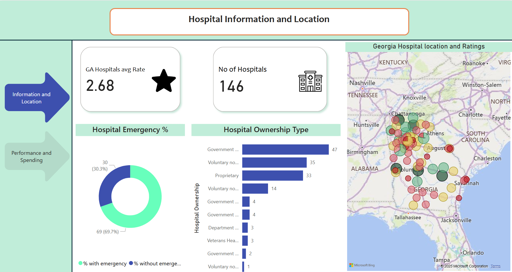
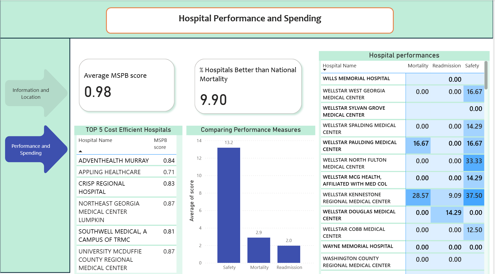

# Sales Insights and Customer Segmentation

## Table of Contents
1. [Project Summary](#Project-Summary)
2. [Tools and Technologies](#Used-Tools-and-Technologies-Used)
3. [Dataset](#Dataset)
4. [How to Use](#How-to-Use)
5. [ETL Workflow](#ETL-Workflow)
6. [SQL Analysis](#SQL-Analysis)
7. [Power BI Dashboard](#Power-BI-Dashboard)

# Project Summary 
This project builds an end-to-end ETL pipeline to process hospital quality and spending data from [CMS (Centers for Medicare & Medicaid Services)](#Dataset).

The pipeline:

- Extracts hospital performance and spending data from CMS APIs

- Transforms the raw data (cleaning, filtering for Georgia hospitals, handling missing values)

- Loads the processed data into a SQL Server database

- Visualizes insights in a Power BI Dashboard

The final dashboard provides insights into:

- Hospital quality metrics (mortality, readmission, safety)

- Emergency services availability

- Medicare Spending Per Beneficiary (MSPB) efficiency

- Comparison across Georgia hospitals

# Tools and Technologies Used
- **SQL (SQL Server)** → Data extraction, transformation, aggregations, Information and Performance
- **Power BI Desktop** → Dashboards & visual storytelling  
- **GitHub** → Version control & portfolio sharing  
- **CMS API** → Data source 

# Dataset
#### Link1 Hospital Information https://data.cms.gov/provider-data/dataset/xubh-q36u#api

#### Link2 Hospital MSPB https://data.cms.gov/provider-data/dataset/rrqw-56er

# How to Use
1. Clone the repository.

2. Extracts hospital performance and spending data from CMS APIs

3. Import the dataset into SQL Server.

4. Run the .sql scripts in the sql/ folder to reproduce analysis results.

5. Import the processed tables into Power BI Desktop.

6. Explore the dashboards in reports folder as pbix or download pdf (.pbix file or screenshots provided).

# ETL Workflow
### 1. Extract (`scripts/extract.py`)

- Fetches data from CMS API endpoints

- Normalizes JSON into flat tables

- Saves as raw CSV files

### 2️. Transform (`scripts/transform.ipynb`)

- Cleans missing/invalid values

- Filters data for Georgia hospitals only

- Converts types (e.g., zip codes → strings, emergency_services → boolean)

- Creates two clean datasets:

    - ga_hospitals_info.csv

    - ga_hospitals_performance.csv

    - ga_hospitals_mspb.csv

### 3️. Load (`scripts/load.py`)

- Connects to SQL Server using sqlalchemy + pyodbc

- Deletes old rows (maintains schema & foreign keys)

- Loads clean data into 3 SQL tables:

    - hospital.information

    - hospital.performance

    - hospital.mspb

# SQL Analysis

### 1. KPIs (`sql/KPIs.sql`)

- Hospitals with and without emergency services
- percent of hospitals better than national mortality

### 2. Performance measurements (`sql/perc_meas.sql`)

- Mortality, readmission, safety performance by hospital
- Top 5 cost efficient hospitals by MSBP score

# Power BI Dashboard
<i>*** TO DOWNLOAD POWER BI DASHBORD PDF OR PBIX FILE *** (`./Powerbi_report/cms Hospitals performance.pdf`) or (`./Powerbi_report/cms Hospitals performance.pbix`)</i>

### 1. Hospital Information and Location

- Map of Georgia hospitals by city/county (colored by overall rating)
- KPI cards: Georgia average rating, Number of hospitals in Georgia
- Donut chart: % hospitals with emergency services
- Bar chart: Hospitals by ownership type

### 2. Hospital Performance and Spending

- Table: Mortality, readmission, safety performance by hospital
- Table: Top 5 cost efficient Hospitals by MSPB (Medicare Spending Per Beneficiary) score 
- Clustered column chart: Compare performance categories
- KPI cards: Avg MSPB score, % hospitals better than national average

